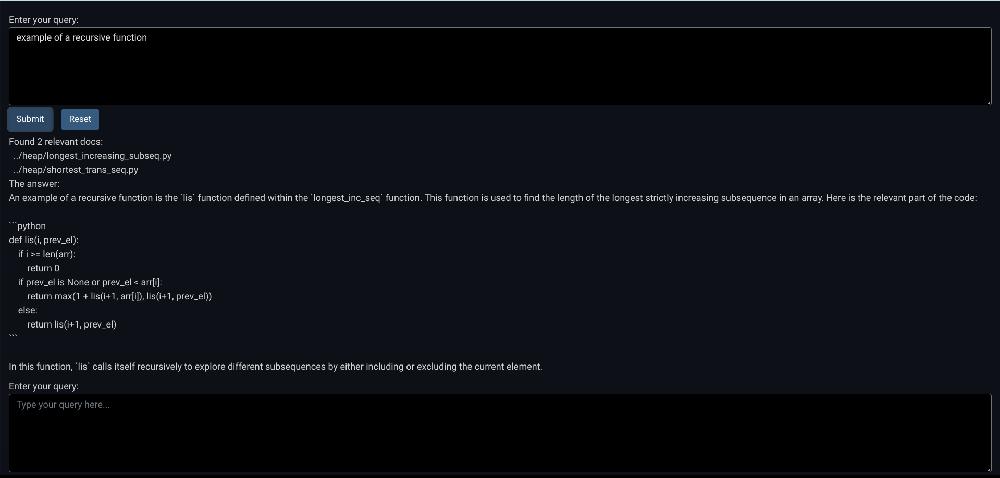
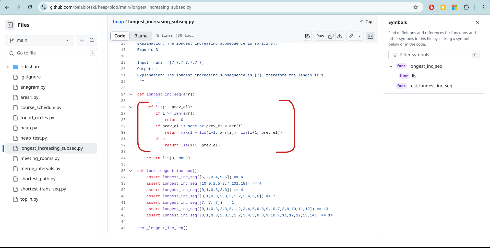

# code_rag

Code RAG

## ChromaDB

API: [localhost:8000/openapi.json](http://localhost:8000/openapi.json)

[Intro](https://docs.trychroma.com/docs/overview/introduction), [Demo](https://colab.research.google.com/drive/1QEzFyqnoFxq7LUGyP1vzR4iLt9PpCDXv?usp=sharing)

Features:
* Store embeddings and their metadata
* Vector search
* Full-text search
* Document storage
* Metadata filtering
* Multi-modal retrieval

Clients:
* Ephemeral client (in memory - `chromadb.Client(Settings(anonymized_telemetry=False))`)
* Persistent client (on disk - `chromadb.PersistentClient(path="/path/to/save/to", settings=Settings(anonymized_telemetry=False))`)
* HTTP REST client (`chromadb.HttpClient(settings=chromadb.config.Settings(anonymized_telemetry=False))`)
   * If using HTTP client only, the full Chroma installation might be skipped. See https://docs.trychroma.com/docs/run-chroma/python-http-client

See also:
* [Opting-out of telemetry collection](https://docs.trychroma.com/docs/overview/telemetry)

## Embeddings

1. https://towardsdatascience.com/neural-network-embeddings-explained-4d028e6f0526/?gi=ee46baab0d8f
2. https://huggingface.co/blog/mteb
3. https://x.com/Nils_Reimers/status/1487014195568775173

## Running RAG application

The [rag_ui.py](./rag_ui.py) starts the webserver and provides PyWebIO UI to the RAG application.

